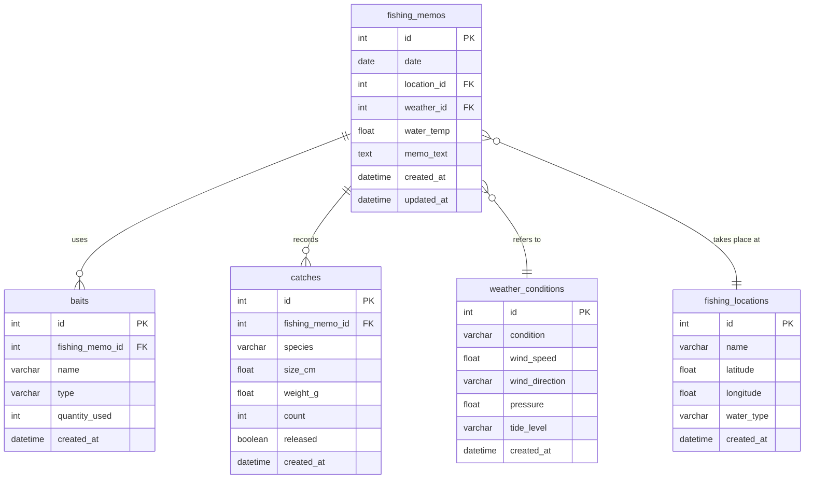

erDiagram

```mermaid
erDiagram

    fishing_memos {
        int id PK
        date date
        int location_id FK
        int weather_id FK
        float water_temp
        text memo_text
        datetime created_at
        datetime updated_at
    }

    baits {
        int id PK
        int fishing_memo_id FK
        varchar name
        varchar type
        int quantity_used
        datetime created_at
    }

    catches {
        int id PK
        int fishing_memo_id FK
        varchar species
        float size_cm
        float weight_g
        int count
        boolean released
        datetime created_at
    }

    weather_conditions {
        int id PK
        varchar condition
        float wind_speed
        varchar wind_direction
        float pressure
        varchar tide_level
        datetime created_at
    }

    fishing_locations {
        int id PK
        varchar name
        float latitude
        float longitude
        varchar water_type
        datetime created_at
    }

    fishing_memos ||--o{ baits : "uses"
    fishing_memos ||--o{ catches : "records"
    fishing_memos }o--|| weather_conditions : "refers to"
    fishing_memos }o--|| fishing_locations : "takes place at"

```
            varchar water_type
