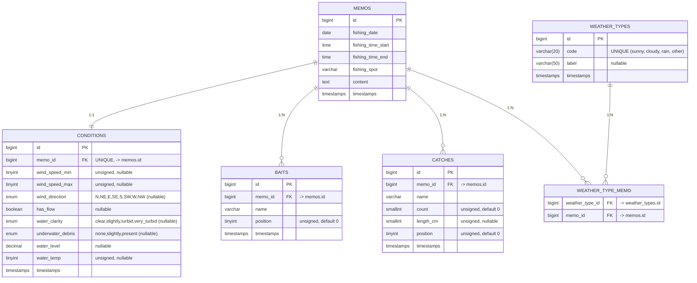

# ER図（正規化後：画像・タグは既存のまま）

以下はMermaidのER図です。VS Codeのプレビューで表示するには、このファイルを開いて右クリック→Open Preview（または Cmd+K, V）してください。図にならない場合は「Markdown Preview Mermaid Support」拡張を入れてください。

補足
- 条件（CONDITIONS）はメモ（MEMOS）と1:1です。
- エサ（BAITS）/ 釣果（CATCHES）は1:Nで position により表示順管理（UNIQUE(memo_id, position) 推奨）。
- 天気（WEATHER_TYPES）はマスタ、weather_type_memo はピボットです。
- 画像・タグ系は既存のままなので本図には含めていません（必要であれば追記可能）。
