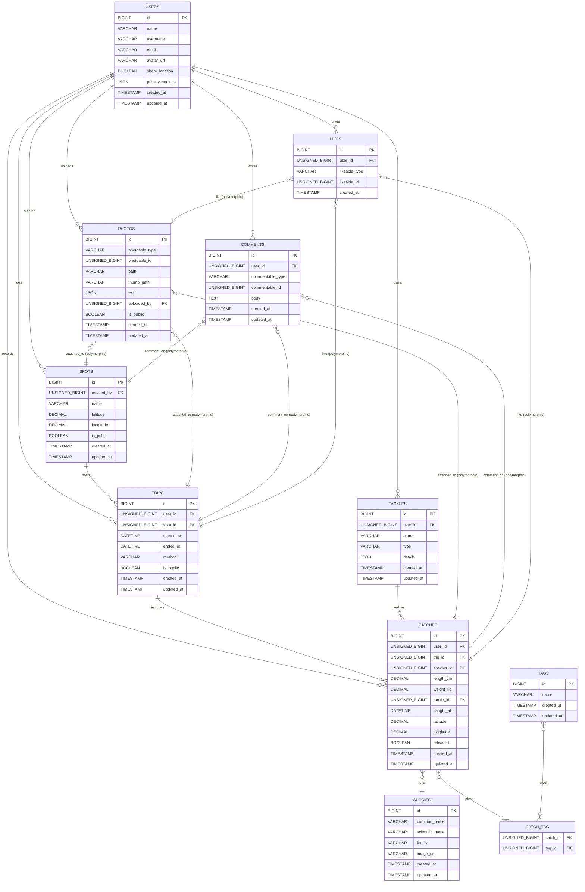

# 釣りアプリ — ER図 (Mermaid)

以下は本アプリのコアデータモデルのER図（Mermaid記法）です。polymorphic（多態）関係を使うテーブル（photos, comments, likes）は複数のエンティティに紐づくことを注記しています。

注記:
- 上図では主キー(PK)・外部キー(FK)・主要フィールドを簡潔に示しています。実際のマイグレーションでは型・制約・インデックスを環境（MySQL/Postgres）に合わせて調整してください。
- photos, comments, likes は polymorphic（photoable/commentable/likeable）で複数のモデルに紐づきます。Mermaidでは補助的に複数の関連線で表現しています。
- 多対多は catch_tag のようなピボットテーブルで表現します。
